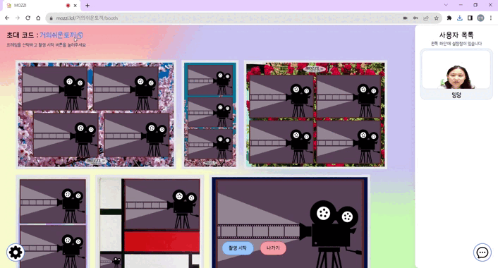
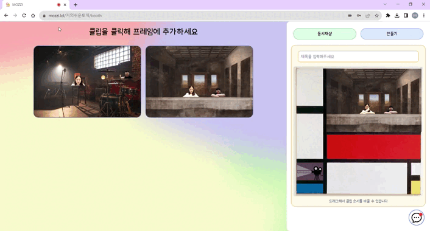

#### DB Dump, Default JWT Token 제외 등 소스 반출 사전 조치 완료
#### SSAFY 9기 공통 프로젝트 우수상

# 🎥 [Mozzi](https://mozzi.lol/)

## SSAFY 9기 공통 프로젝트 - A109 Team Garlic  
### 비대면 단체 클립영상 촬영 플랫폼, Mozzi  
> [https://mozzi.lol/](https://mozzi.lol/)  
  
  
# 👨‍👩‍👧‍👦 팀원 소개
- [곽민규](https://github.com/RookMG) : Frontend&Backend / Leader  
- [김민정](https://github.com/kimminjeong05) : Backend / Backend Leader  
- [박준홍](https://github.com/ssumthingood) : Frontend / Frontend Leader  
- [유창재](https://github.com/zzangjae) : Backend
- [윤태영](https://github.com/yyytae0) : Frontend  
- [정우정](https://github.com/ssafyWooJeong) : Backend / DevOps  
  
  
# 📆 프로젝트 소개
* 프로젝트명  
  비대면 단체 클립영상 촬영 플랫폼, Mozzi  
   
* 서비스 특징  
  WebRTC 기술을 활용해 각 참가자의 웹캠 영상에서 실시간으로 배경을 제거해 한 화면에 합성, 서로 다른 공간에 있어도 함께 있는 것처럼 영상 찍기  
   
* [UCC 영상, 시연 영상](https://pattern-ounce-358.notion.site/d63b8f36c8664fe3856c11dce39c44a4)  
  
# ✨기획 배경
### 1. 단체사진/영상 수요의 지속적인 성장
- 시간이 갈수록 단체사진에 대한 수요는 꾸준히 증가하고 있다.
### 2. 공간상의 제약
- 단체사진에 대한 수요는 증가하지만 그 특성상 공간상의 제약으로 인원의 제한이 생기거나 자리에 없는 사람의 촬영이 불가능하다.
### 3. Zoom과 같은 비대면 회의 서비스의 한계
- 분리된 UI로 인해 단체로 사진이나 영상을 남기고 싶어도 같은 장소에 있는 현장감이나 소속감에 한계가 존재한다.
  
  
# 🙌주요 기능
 ### 1. 촬영 준비 및 개인 설정
 함께 촬영할 사용자들을 위한 부스를 제공하고 촬영에 사용될 기능들을 제공한다
 - 로그인한 유저는 메인페이지의 부스생성을 통해 부스를 만들고 해당 부스의 공유코드를 이용해 다른 유저들을 초대할 수 있다
 - 촬영에 사용할 프레임을 확인하고 선택할 수 있다
 - 채팅을 이용하여 마이크를 사용하지 못하는 사용자와도 원할한 소통이 가능하다
 - 개인설정을 이용하여 카메라 기울임, 크기, 자동 설정을 할 수 있다
 ### 2. 촬영 및 영상 합성
 배경을 제공하고 영상 합성에 적합한 기능들을 제공한다
 - 배경 변경하기를 통해 방장이 가진 배경을 업로드하거나 제공된 배경을 이용하여 영상을 촬영할 수 있다.
 - 유저목록을 확인하고 드래그를 통해 사용자들의 앞 뒤 위치를 조정할 수 있다
 - 촬영 버튼을 이용하여 배경과 사용자들의 움직임을 영상으로 저장한다
 ### 3. 영상편집 및 저장
 제공한 프레임을 기반으로 영상 편집을 도와주고 완성된 영상과 개별 클립들에 대한 다운로드를 지원한다
 - 클릭이나 드래그로 프레임을 편집할 수 있다
 - 만들기를 눌러 완성된 클립을 mp4, gif 등 다양한 확장자로 다운로드할 수 있다
 - 클립을 만들기 위해 저장된 개별 클립들에 대한 저장 또한 mp4, gif 등 다양한 확장자로 다운로드 할 수 있다.
 ### 4. 공유 및 좋아요
 - 마음에 드는 클립을 커뮤니티에 등록할 수 있다
 - 커뮤니티를 통해 다른 사람들의 클립을 구경하고 좋아요를 할 수 있다
    
    
# 시연 설명
### 메인 페이지

- 로그인 된 사용자는 부스 생성하기를 클릭하여  새로운 부스를 생성할 수 있습니다.
- 공유코드를 알고있다면 부스 참가하기를 클릭하여 생성된 부스로 참가할 수 있습니다.

### 촬영 준비 페이지

- 부스 화면에서는 촬영에 사용할 원하는 프레임을 선택할 수 있습니다.
- 개인 설정 기능을 사용하여 카메라 회전, 크기 조절, 마이크/비디오 on&off가 가능합니다.
- 채팅 기능을 사용하여 마이크가 되지 않는 사용자와도 대화를 할 수 있습니다.

### 촬영 페이지

- 실제 촬영이 진행 될 배경을 선택하거나 원하는 배경을 업로드하여 사용할 수 있습니다.  
- 카메라 소스의 위치, 크기를 마우스를 이용해 조절 할 수 있습니다.
- 유저 목록의 순서를 바꾸어 영상에 표시되는 사용자들의 위치를 변경할 수 있습니다.

### 편집 및 저장 페이지

- 촬영한 클립들을 클릭이나 드래그하여 프레임을 편집할 수 있습니다.
- 완성한 클립과 촬영한 개별 클립들을 webm, mp4, gif의 형태로 저장할 수 있습니다.
- 로그인한 참가자의 경우 제목을 지정하여 마이페이지에 등록할 수 있습니다. 

### 커뮤니티

- 촬영한 모찌롤들을 커뮤니티에 게시할 수 있다.
- 다양한 사람들이 찍은 모찌롤들을 보고 다른 아이디어를 얻을 수 있다.
- 좋아요/시간 순으로 모찌롤 게시물들을 볼 수 있다.
- 내 모찌롤은 나중에 다운로드 받을 수 있고, 커뮤니티에 공유 여부를 정할 수 있다.
  
  
# 💁 설계
### [🧱 서비스아키텍쳐](https://www.notion.so/4a0a6b88d9e441058dc0e8bcd2995434)  

### [📱 화면흐름도](https://www.notion.so/0528422cb76b41e686f20c8e7e8a4294)  

  
### [🎩 와이어프레임](https://www.figma.com/embed?embed_host=notion&url=https%3A%2F%2Fwww.figma.com%2Ffile%2FGsUUmt9HyBKVr3m8NPzqdP%2FInsaengClip%3Ftype%3Ddesign%26mode%3Ddesign%26t%3D0E7AlPhWhJF6ljF7-0)  

### [🎨 ERD](https://www.notion.so/ERD-8f884a4d995349e38206cfe4396cc81a)  

  
### [📬 API 명세서](https://www.notion.so/adf01362ac67439c8486bdecc2f2862a?v=fe04bea7894e40c6a50a95fc4c274b65)  
명세서는 링크로 참고해주세요.  
  
### [📋 컨벤션](https://www.notion.so/4b2b4dca34a446db8ee0e19284e0050c?v=c82137a32d1449b68b52d52ae0653168)  
컨벤션은 링크로 참고해주세요.  
   

# 향후 계획
- 현재에는 Host에서 집중된 권한들을 다른 유저들에게도 분산시키거나 다른 유저들이 보고 있는 배경을 공유하는 등 사용자들간의 상호작용을 더욱 확장시킬 수 있다.
- 실제 서비스를 통해 다양한 컨텐츠들을 만들어볼 수 있다.
  

# ⚙ 개발 환경 및 IDE
### Frontend  
> 

### Backend
> 

### Server
> 

### WebRTC
> 

### Team Work
> 

  

## 카테고리

| Application | Danguage |  Language|
| ---- | ---- | ---- |
| :white_check_mark: Desktop Web | :white_check_mark: 웹 기술 | :white_check_mark: JavaScript | :black_square_button: Vue.js |
| :white_check_mark: Mobile Web | :black_square_button: 웹 디자인 | :black_square_button: TypeScript | :white_check_mark: React |
| :white_check_mark: Responsive Web | :black_square_button: 웹 IoT | :black_square_button: C/C++ | :black_square_button: Angular |
| :black_square_button: Android App | :black_square_button: IoT | :black_square_button: C# | :white_check_mark: Node.js |
| :black_square_button: iOS App | :black_square_button: 모바일 | :black_square_button: Python | :black_square_button: Flask/Django |
| :black_square_button: Desktop App | | :white_check_mark: Java | :white_check_mark: Spring/Springboot |
| | | :black_square_button: Kotlin | |